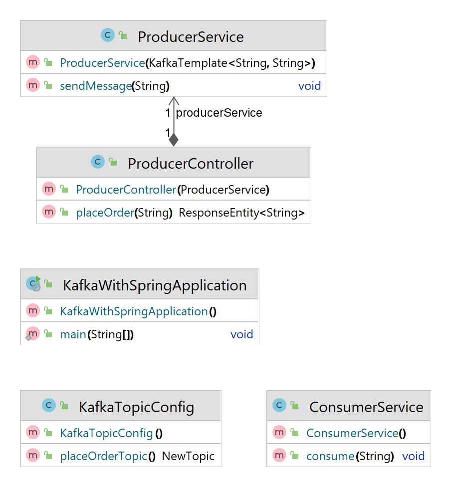

# KafkaCode


## Things Newly Implemented

1. Created new Model object - User
2. The Rest Controller Takes Model object as input in POST Mapping method
3. MessageBuilder is used to build the Payload from User Model Object
4. Added Asynchronous Callback by getting return value from send in producer

## Already Exists

1. ProducerController is RestEndpoint which calls ProducerService
2. ProducerService pushes msg to kafka broker
3. ConsumerService  keeps listening to specific topic and prints the msg once the ProducerService is available in broker  


## View msg from URL in consumer console
```xml
kafka-console-consumer.bat --topic MsgTopic --bootstrap-server localhost:9092 --from-beginning
```


